## Notes on Salesforce Reports and Dashboards

### Metrics for Objectives 

Start at the top with the executives and key stakeholders:

 - Ask "What keeps them up at night?" 
 
 - Define what your executives and your channels need to know to run their business: 
 
 - What are their key performance indicators (**KPI**)? 
 
 - What behaviors do they want to encourage? 
 
 Once you know the answers:
 
 -  align those **targeted metrics** with your company vision by taking:
       
 	- your business objectives
 	-  identifying the **metrics**  - data points that measure those **objectives** to provide insight and map those back to your Salesforce **reports**.

 
**Examples:**

	
  

### Folder Permissions

 Folder management is the foundation for **scalable** report management across your organization. 
 
 Access to reports and dashboards is controlled through settings for the folder they are stored in. 
 
To give others access to your reports or dashboards, place them in a **shared folder**. 

To prevent others from accessing your reports, place them in **personal folders** that only you can access.
 
Consider **scalability and consistency** in the **long term** when coming up with a strategy

Common folder management strategies:

1. By function (for sales, service, marketing, or operations) 
    
2. By role (based on your organizational hierarchy)
    
3. By location (national, regional, and office-level report folders)

**Public folders**

Public folders are accessible by everyone in your company, and are great for curating report content. Make sure that only certain people have access to saving in public folders.

Place reports used in shared/cloned dashboards in a **folder** where the dashboard running user has **viewer permission**. 

If users have access to the underlying data in a report, it is best practice to grant access to the **related dashboards** that contain those reports, too.

Proactively delete folders that are no longer being used.

### Clean Data = Accurate Reporting 

Data quality is the yeast in the bread of business!

No matter how simple, sophisticated, or smart—reports and dashboards cannot compensate for data inaccuracy!

Commit to getting the **right data** into the system at the **right time**.

- "If it is not in Salesforce, it doesn't exist." 

Bad Data is reponsible for:

- Lost revenue

- Missing or inaccurate insights

- Wasted time and resources

- Inefficiency

Slow info retrieval

Poor customer service

Reputational damage

Decreased adoption by reps

#### Duplicate management

Use duplicate management to control whether and when users can create duplicate records in Salesforce, customize the logic used to **identify** duplicates and the user interface for **handling them**, and create reports on duplicates that users save.

Duplicate management is set up and turned on by default for **business accounts, contacts, and leads**. 

To use duplicate management for person accounts:

 - enable person accounts
 - activate person account matching and duplicate rules in Setup

Following conidtions will make reports **not much useful**: 

 - Missing Records
 - Incomplete Records
 - Stale Data
 - No Data Standards (Data Governance)
 

### Improve Report Performance

 
Key: Reduce Amount of data

A report can take anywhere from a few seconds to several minutes to run

If the report exceeds the timeout limit and fails or the report is slow to load, it’s usually because it is:

- Querying too many objects
- Dealing with intricate lookups
- Has too many fields

When filtering, use the **equals or not equal** to operators instead of **contains or does not contain**. 

For example, use Account Owner **equals** John James instead of Account Owner **contains** John. 

Choose AND rather than OR for filter logic

Narrow your report’s date range, use time frame filters. 

For example, use **Last 30 Days** instead of **Current FY**.

Set time frame filters by choosing a **Date Field** and **Range** to view. Only records for that time frame are shown.

Use report filters that emphasize the use of standard or custom indexed fields. Use index fields in report filters, whenever possible

Reduce the number of fields in the report by **removing unnecessary columns** or fields.

If you receive an error message saying that your activity report has too many results, **filter** on a picklist, text, or date field.

**De-normalize data**:

De-normalize data when practical—“over de-normalizing” the data results in more overhead. 
Use summarized data stored on the **parent record** for the report. This practice is more
efficient than having the report summarize the **child records**

** Data Archiving **
 Reduce the amount of data by archiving unused records—move unused records to a custom object table to reduce the size of the report object.

#### What is  Report Type?

Report type is like a template which makes reporting easier.

 - determines which fields and records are available for use when creating a report
 -  based on the relationships between a **primary object** and its **related objects**
 
 
- Reports display only records that **meet the criteria** defined in the report type

##### Out-of-box standard report types:

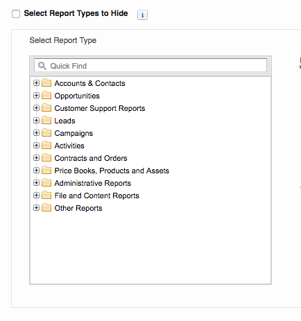
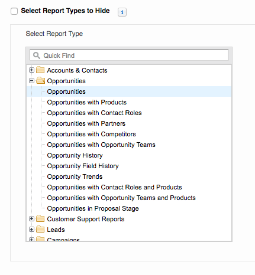

### What is a dashboard?

A dashboard is a visual display of key metrics and trends for records in your org.

The relationship between a **dashboard component and report is 1:1**; for each dashboard component, there is a single underlying report. 

Also, you can use the **same report** in **multiple dashboard components** on a single dashboard (use the same report in both a bar chart and pie chart)

Like reports, dashboards are stored in folders, which control who has access.

If you have access to a folder, you can view its dashboards. However, to view the dashboard components, you need access to the underlying reports as well. Y

Each dashboard has a **running user**, whose security settings determine which data to display in a dashboard.

If the running user is a **specific user**, all dashboard viewers see data based on the security settings of **that user**—regardless of their own personal security settings. For this reason, you’ll want to **choose** the **running user wisely**, so as not to open up too much **visibility**. 

For example, set the Sales Manager as the running user for a leaderboard for her team. This allows her team members to view the leaderboard for their individual team, but not other teams.

**Dynamic dashboards**

Dynamic dashboards are dashboards for which the running user is always the logged-in user.

If you’re concerned about too much access, dynamic dashboards might be the way to go.

#### Report Formats
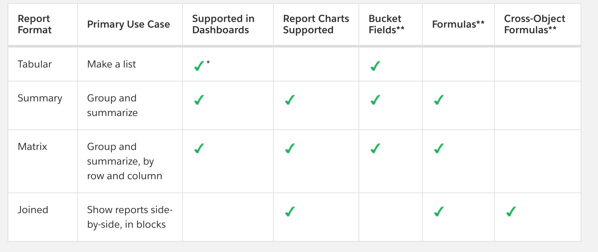

### Tabular

Simply of an ordered set of fields in columns, with each matching record listed in a row. 

-  easy to set up
-  can't be used to **create groups of data** 
-   there are limits to how you can use them in dashboards.
-   often best used for tasks like generating a mailing list.

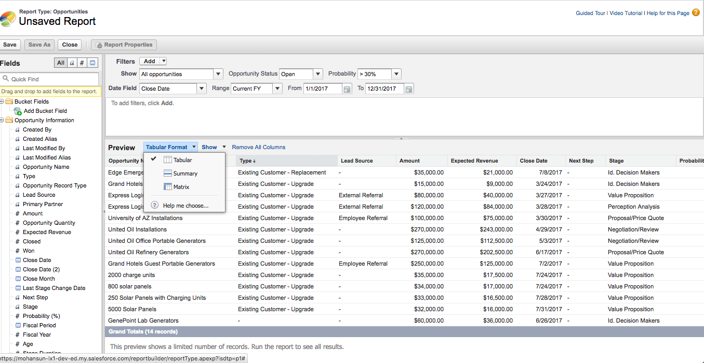

### Summary Reports

Summary reports are similar to tabular reports, but also allow users to group rows of data, view subtotals, and create charts.

- Great for use in dashboards
- workhorses of reporting

#### Account Group By Rating

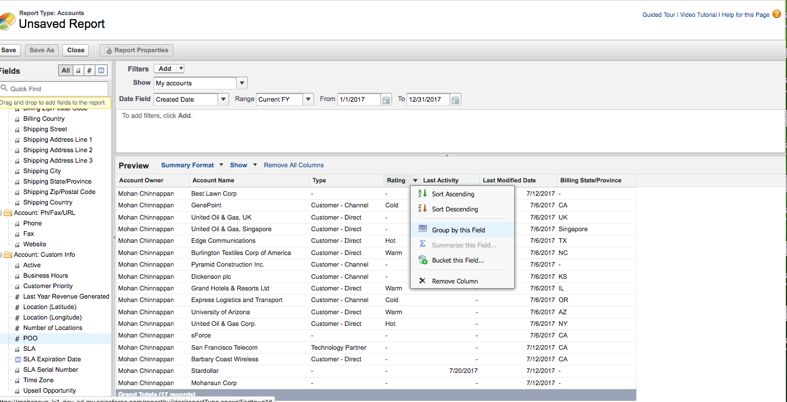

#### Select Summarize this Field

#### SUM

#### Summarized Report

##### Bucketing

Bucketing lets you quickly categorize report records without creating a formula or a custom field.

 When you create a bucket field, you define multiple categories (buckets) used to group report values.
 
 Types of buckets:
 
 - Numberic
 - Text
 - Picklist 
 
 [Video](http://salesforce.vidyard.com/watch/PHKaSARJY--nhdLAbp0UtA)

##### Bucketing example for Account.Type

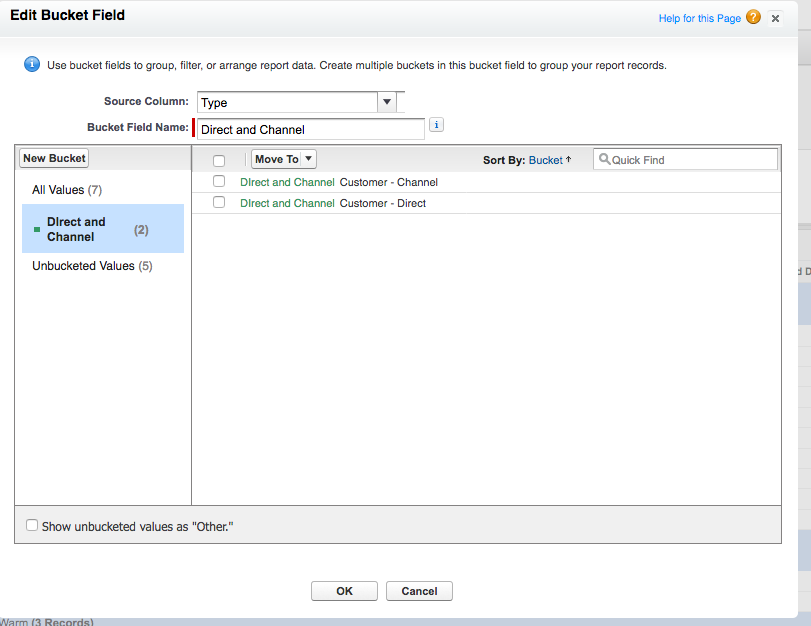
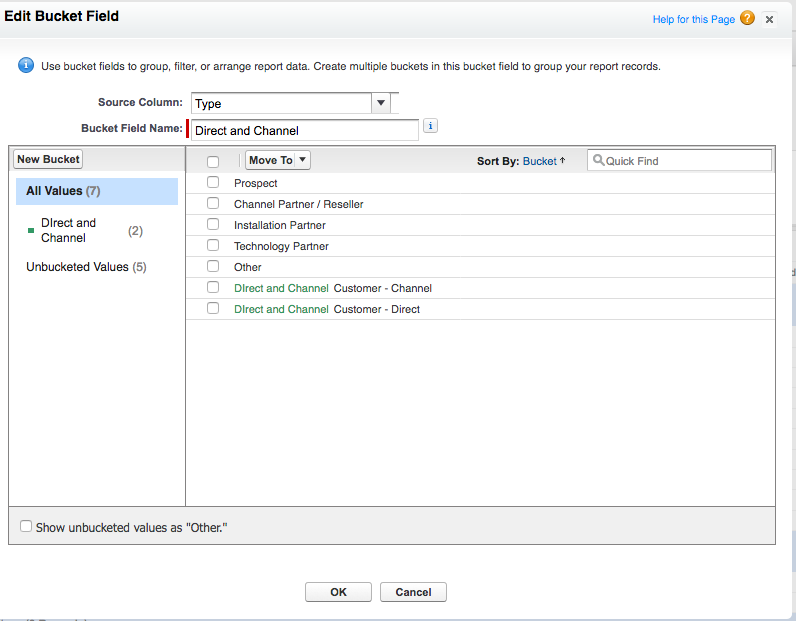
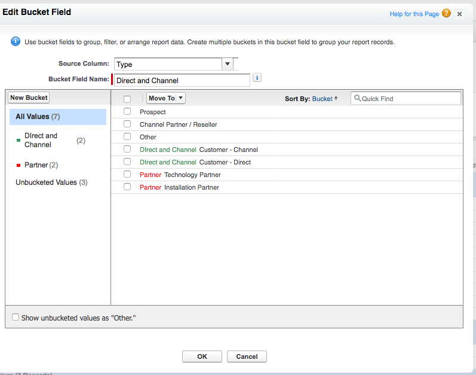
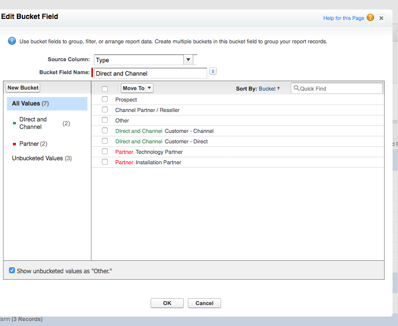
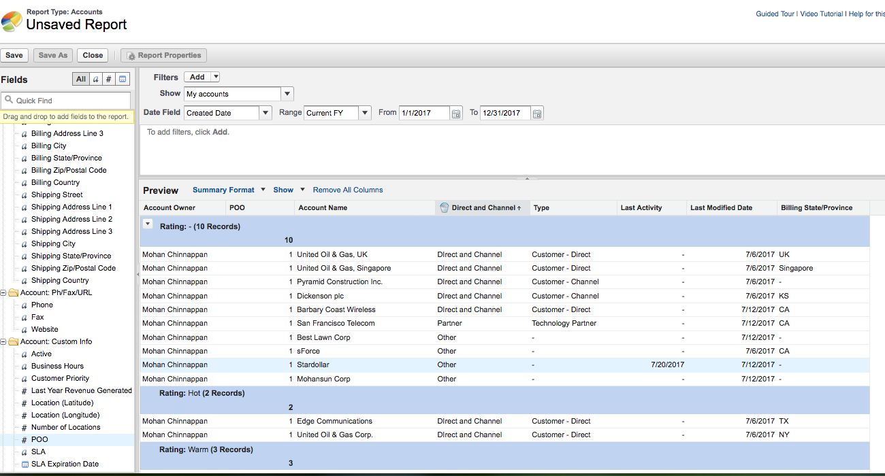

#### Playing with Bucketing fields

 

### Matrix Reports 

 [Video](https://www.youtube.com/watch?v=5Lcxh-_U6P8)
 
 When you change to Matrix report from a Summary report:
 
 1. Top level group in the Summary report becomes the **row grouping**
 2. 2nd level grouping becomes the **column groupings**

  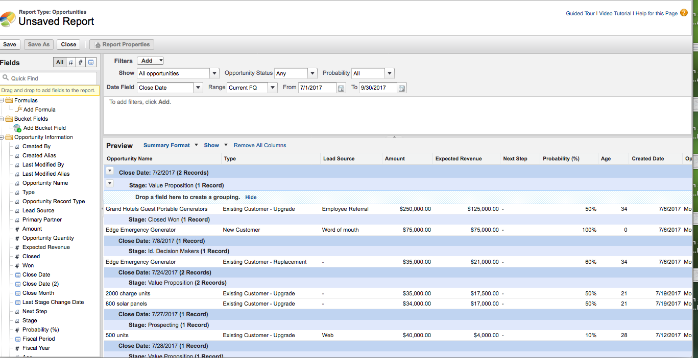
 
  TO:
  
  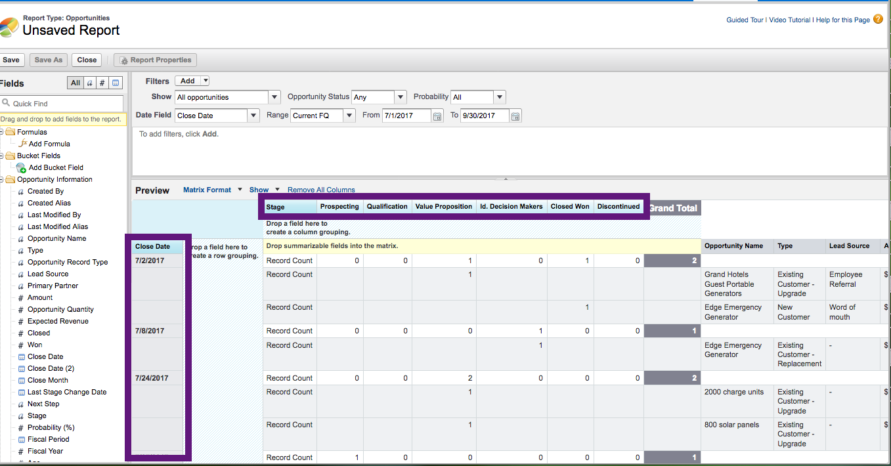
  
  
 How to Switch the groupings columns to rows and vice-versa?
 
  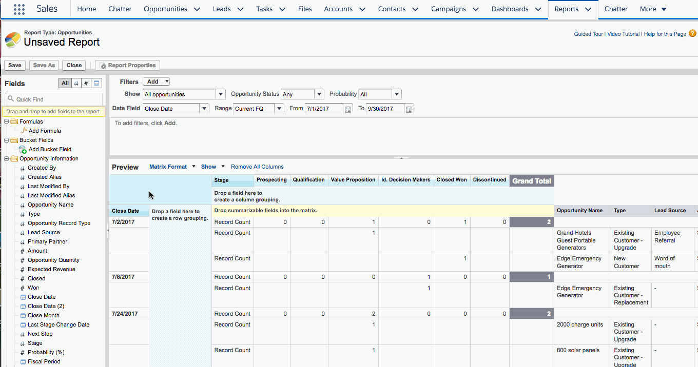
  
 
 With Summary:
 
 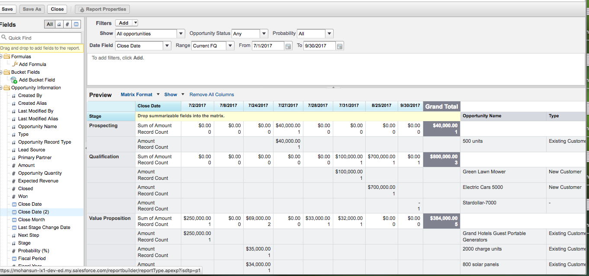

### Joined Reports

A joined report can contain data from multiple **standard or custom report types**. You can add report types to a joined report if they have **relationships with the same object or objects**. 

For example, if you have a joined report that contains the **Opportunities report type**, you can add the **Cases report type** as well because both have a relationship with the **Accounts object**.

A joined report consists of up to five report blocks, which you add to the report to create multiple views of your data

[Video](http://salesforce.vidyard.com/watch/9HiLP7WVAApjQHhyA9QRUQ)

Example:

Show Accounts with :

1. **Open Opportunities** 
2. **Closed Opportunities** 
3. **Open Cases**

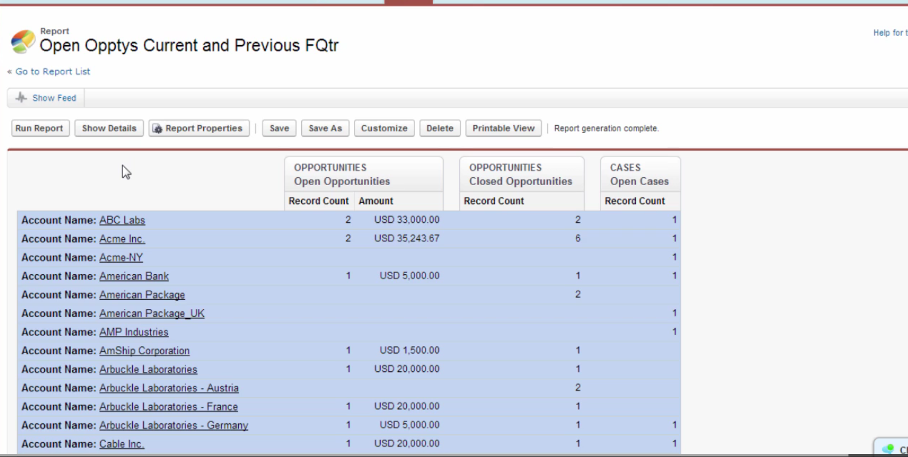

Steps:

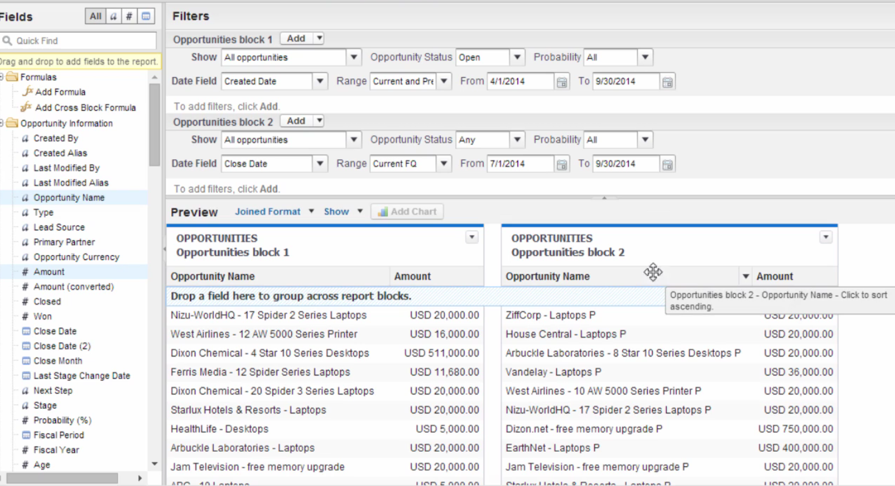

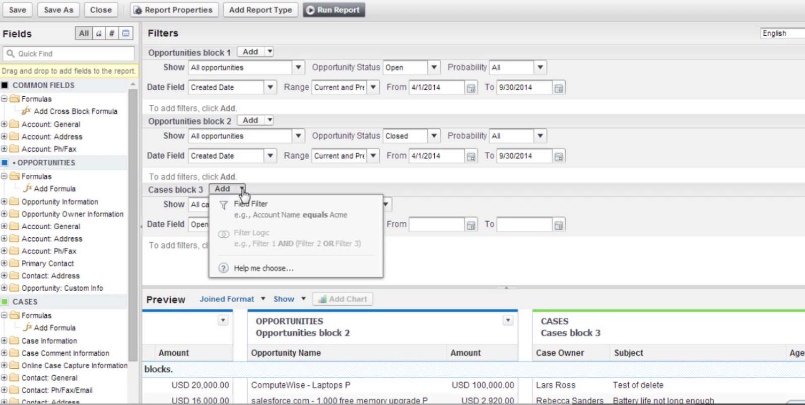

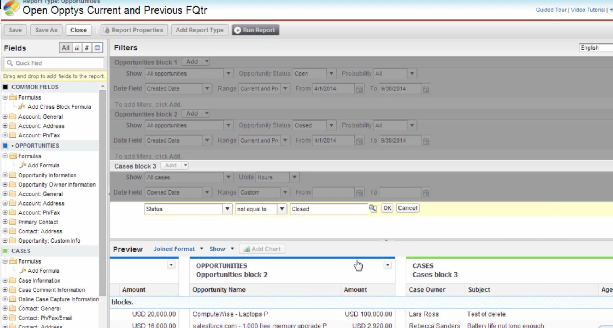

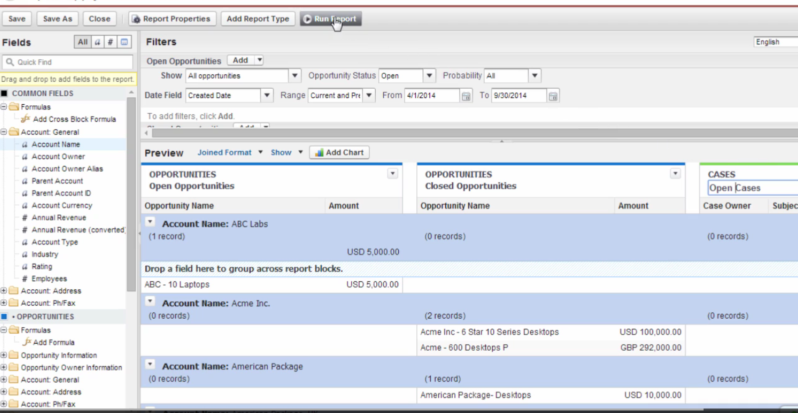

### Power of One 

Create a new custom field on the object that you want to count in your Reports 

1. Create a custom field of Data Type: Formula
2. Formula Return Type as Number (0 decimals)
3. Build the Formula: 1 - So this formula returns value 1

#### Select Summarize this Field

#### SUM

#### Summarized Report

#### Questions

1. Maximum grouping levels in Summary Reports?

	3
	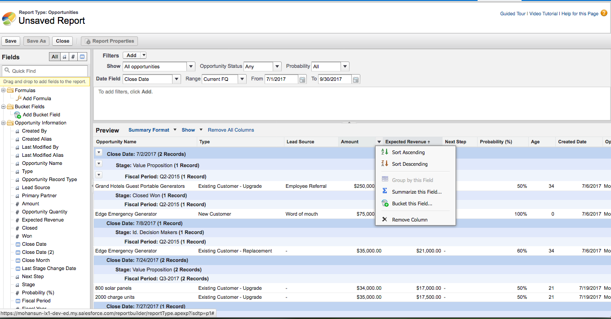
	
2. Maximum number of objects you can associate in a custom-type report?

	4
	

#### References

1. [Manage Access to Reports and Dashboards](https://help.salesforce.com/articleView?id=faq_reports_control_access.htm&type=0)
2. [Reports Best Practices](https://help.salesforce.com/articleView?id=000230049&type=1)
3. [ Compare Access Levels for Report and Dashboard Folders ](https://help.salesforce.com/articleView?id=analytics_folder_access_chart.htm&type=0)
4. [Improve Data Quality](http://pages.mail.salesforce.com/page.aspx?QS=3935619f7de112ef3fdd44cfb3dcb15df8ef83257379ba31)
5. [Duplicate Management](https://help.salesforce.com/articleView?id=managing_duplicates_overview.htm&type=0)
6. [Improve Report Performance](https://help.salesforce.com/articleView?id=improving_report_performance.htm&type=0)
7. [Get The Most Out Of Your Data](http://salesforce.vidyard.com/watch/Gt-51vmOkd48X9c5Dplx6A)
8. [Intro to Reports and Dashboards](https://trailhead.salesforce.com/en/modules/reports_dashboards/units/reports_dashboards_overview)
9. [Joined Reports](https://help.salesforce.com/articleView?id=reports_joined_format_concepts.htm&type=0)
10. [6 Steps toward top Data Quality](https://help.salesforce.com/articleView?id=000025304&type=1)

#### Videos

1. [Getting Started with Report Builder](https://www.youtube.com/watch?v=7_LkmrhKf2g)

